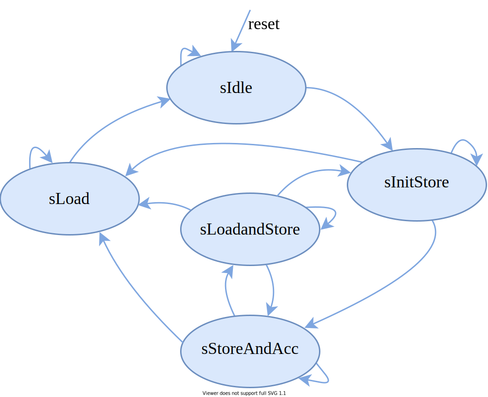

Digital Accumulator written in Chisel HDL
=======================================================

## Overview
This repository  contains accumulator module written in [Chisel ](https://www.chisel-lang.org/) hardware design language.  In the text below, module specification together with parameters definition, description of the interface and control logic is given. The accumulator consists of two stages, first stage accumulates data and drives second stage while second stage is actually simple Queue which should be controlled in that way that it never becomes full (prevent data loss). With those two stages, continues data accumulation is accomplished and slow data rate can be provided at the output of the accumulator.

## Spectral Accumulator

Global block scheme of the accumulator showing inout signals as well as control registers and parameters is presented in the figure below.

### Interface of the first stage of the Accumulator

#### Inputs 

[Decoupled](https://github.com/freechipsproject/chisel3/wiki/Interfaces-Bulk-Connections) interface is used where .bits is input sample
* `in: Flipped(Decoupled[T])` - input  sample (for instance: fft magnitude samples) wrapped with valid/ready signals
* `lastIn: Bool` - indicates the last sample in the input stream and triggers data flushing, it is assumed that this signal, when it is asserted,  it is always asserted at the end of the fft window 
* Optional control registers: 
* `accDepthReg` - number of used memory locations inside accumulator (run time configurable fft size requires that this parameter is also run time configurable)
* `accWindowsReg` - defines number of accumulated fft windows

#### Outputs

Decoupled interface is used where .bits is output sample
* `out: Decoupled([T])` - output sample wrapped with valid/ready signals
* `lastOut: Bool` - indicates the last sample in the output stream 

State machine which controls data flow is represented in the figure below. Diagram is more or less self-explanatory but short explanation of the each stage is given below. Transition signals are omitted for clarity (check fsm description inside `Accumulator.scala` for more details).
 * `sIdle` - reset state, stays in this state until fire signal from input side doesn't occur.
 * `sInitStore` - initial storing state, no accumulation just storing input data to memory. Stays in this state until entire fft window is stored.
 * `sStoreAndAcc` -  storing and accumulation at the same time, stays in this state until specified number of fft windows is accumulated or until `lastIn` signal is asserted.
 * `sLoadAndStore` -  sending accumulated data to output and at the same time storing new input data to accumulator memory. Stays in this state until all data are loaded or `lastIn` signal is asserted.
 * `sLoad` - state where only loading is active, stays in this state until all data from accumulator are sent to the output.

Reading from and writing to accumulator is presented below. It is assumed that storing stage is currently active.

### Second stage of the Accumulator 
Second stage of the accumulator is actually [DspQueue](https://github.com/ucb-bar/dsptools/blob/fda2c1c3f9c5b5ea88e8a689880af24521cc101d/rocket/src/main/scala/dspblocks/DspQueue.scala) . This block is available inside `DspQueueBlock.scala`  and code differs than original version only in register size, memory mapped interface uses `beatBytes` equal to 4.
For more useful information about `DspQueue` check [CARRV’18](https://carrv.github.io/2018/papers/CARRV_2018_paper_12.pdf) .

Previously explained module is described with following Scala files available inside`src/main/scala` directory:

 * `AccParams.scala` - defines accumulator parameters
 * `Accumulator.scala` -  contains accumulator module
 * `AccDspBlock.scala` -  contains accumulator module wrapped as generic DSP block
 * `AccChain.scala` - contains chain which connects first stage `Accumulator` and second stage `DspQueueBlock`
 * `DspQueueBlock.scala` - contains simple `DspQueueBlock` module
 
 
### DspBlock
The first stage is wrapped as generic DSP block in a diplomatic interface which is actually AXI4-Stream for inputs and outputs and memory-mapped (TileLink, AXI4, APB or AHB) for control and status registers. This wrapping is important so that first and second stage can be easily united as `DspChain` and as that, used in larger systems which require continues data streaming and data accumulation.

## Parameter settings

Design parameters should be defined inside `case class ACCParams`.
The explanation of each parameter is given below:

* `accDepth` - number of memory locations inside accumulator (number of points in FFT)
* `proto`    - input/output data type
* `protoAcc` - accumulator data type
* `maxNumWindows` -  defines maximal number of accumulated fft windows (directly defines the data width of the `accWindowsReg` register)

## Prerequisites

The following software packages should be installed prior to running this project:
* [sbt](http://www.scala-sbt.org)
* [Verilator](http://www.veripool.org/wiki/verilator)

## Tests

Besides main source code, some tests for accumulator module are provided in this repository. Below is given list of the files located in `src/test/scala` which describe different testers and test cases.   

* `AccFirstStageSpec` -  contains tests for the first stage of the accumulator
* `AccChainSpec` - contains test for `AccChain` module. Test uses `AXI4MasterModel` and `AXI4StreamModel` for proper register initialization and streaming transactions generation.

